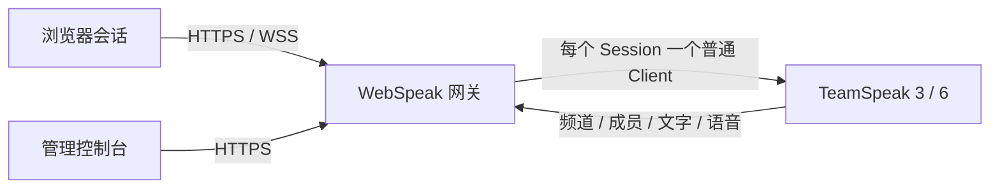

<div align="center">

# WebSpeak

**让 TeamSpeak 真正进入浏览器。**

自托管的 TeamSpeak 3 / TeamSpeak 6 网页客户端与语音接入网关。无需安装桌面客户端，无需 ServerQuery，无需维护机器人；打开浏览器，即可进入你的语音空间。

[](LICENSE)
[](https://nodejs.org/)
[](https://www.teamspeak.com/)
[](LICENSE)

[中文](#中文) · [English](#english) · [快速开始](#快速开始) · [架构](#架构) · [安全边界](#安全边界)

</div>

> WebSpeak 是一个连接层，而不是 TeamSpeak 服务端替代品。它为每一个浏览器会话建立独立的普通 TeamSpeak Client 连接，并把频道、成员、文字与语音能力安全地带到 Web 端。

## 中文

### 为什么是 WebSpeak

| 体验 | WebSpeak 的答案 |
| --- | --- |
| 加入方式 | 浏览器打开链接即可加入，不安装桌面客户端 |
| 数据来源 | 每个浏览器 Session 的独立 TeamSpeak Client 连接 |
| 服务端依赖 | TeamSpeak 3 / TeamSpeak 6；不依赖 ServerQuery、WebQuery 或维护账号 |
| 连接模型 | HTTPS / WSS 连接 WebSpeak，WebSpeak 连接目标 TeamSpeak |
| 入口控制 | 固定目标、开放目标、一次性受控邀请三种路径 |
| 语言与主题 | 访客端和管理控制台均支持中英文与主题切换 |

### 核心能力

| 领域 | 已提供 |
| --- | --- |
| 语音 | Opus / PCM 桥接、自由麦、按键说话、VOX、连接状态与重连提示 |
| 设备 | 浏览器麦克风与扬声器选择、音量调节、实时输入电平、本地麦克风测试 |
| 频道 | 频道树、频道切换、成员移动、频道文字聊天、服务器事件与状态展示 |
| 成员 | 在线成员、发言绿色头像边框、Away 状态、私聊、Poke、昵称复制、成员音量 |
| 管理 | 默认账号首次登录强制改密、默认 TeamSpeak 目标、站点信息、真实连接测试 |
| 运维 | 活动 Session、邀请创建与撤销、审计事件、结构化日志、诊断报告、SQLite 备份 |
| 浏览器体验 | 响应式布局、移动端按住说话、内部滚动容器、浏览器本地收藏与最近连接 |

### 架构



这套模型的关键点是：成员与频道信息来自对应浏览器会话本身。WebSpeak 不需要额外占用一个“维护系统数据”的 TeamSpeak 用户，也不通过 Query 接口拼装一份旁路目录。

### 快速开始

#### 方式 A：从 Dockerfile 构建

```bash
docker build -t webspeak:local .
docker volume create webspeak-data
docker run -d \
  --name webspeak \
  --restart unless-stopped \
  -p 3040:3040 \
  -v webspeak-data:/data \
  webspeak:local
```

容器固定监听 `3040`，SQLite 数据库、安装级主密钥和日志保存在 `/data`。公网部署时，请在前面配置 HTTPS 反向代理；麦克风和部分浏览器音频能力需要安全上下文。

#### 方式 B：源码运行

环境要求：

- Node.js `22.5.0` 或更高版本。
- `@discordjs/opus` 所需的原生编译工具；Linux 通常需要 `python3`、`make`、`g++`。
- 一台可访问的 TeamSpeak 3 或 TeamSpeak 6 服务端。
- 较新的 Chrome 或 Edge；生产环境建议使用 HTTPS。

```bash
npm ci
npm --prefix web ci
npm --prefix web run build
npm run build
node dist/index.js
```

随后打开：

```text
http://127.0.0.1:3040/
```

### 首次登录与默认目标

1. 打开 `/admin`。
2. 使用默认账户 `admin / admin` 登录。
3. 按页面要求设置一个至少 12 个字符的新管理员密码。
4. 在“服务器”页面的“默认 TeamSpeak 目标”中填写服务器地址与语音端口。
5. 执行连接测试并保存。

欢迎页没有邀请链接目标参数时，会使用管理员设置的默认 TeamSpeak 目标进行预填写。邀请链接参数优先；固定模式下访客只能进入管理员配置的目标，开放模式下访客可以输入经过安全校验的公网目标。

WebSpeak 的 HTTP 端口固定为 `3040`，TeamSpeak 默认语音端口为 `9987`。目标地址在界面中拆分为“地址”和“语音端口”两个字段；旧版 `地址:端口` 与 `地址#端口` 文本仍可兼容解析。

### 访问模式与邀请

| 模式 | 行为 | 适用场景 |
| --- | --- | --- |
| `fixed` | 访客不改变目标，服务端管理目标与服务器密码 | 私有社区、固定服务器 |
| `open` | 访客可输入公网目标与本次会话密码 | 临时接入、多服务器入口 |
| 受控邀请 | 管理员生成一次性、可过期、可限次、可撤销链接 | 活动、临时房间、定向分享 |

开放模式会在 DNS 解析后阻止 loopback、私网、链路本地、组播、广播和保留地址，并使用已验证的 IP 进行实际连接。服务器密码不会写入分享链接、浏览器本地存储或 WebSocket URL。

### 音频与设备

进入语音空间后，在设置中可以：

- 选择浏览器检测到的麦克风与扬声器；
- 切换自由麦和按键说话；
- 调整输入、输出、通知音量与 VOX 阈值；
- 查看麦克风权限、实时输入电平和音频上下文状态；
- 使用最多 5 秒的本地麦克风测试，录音只在浏览器本地播放，不发送到 TeamSpeak。

设备标签由浏览器权限模型决定。首次选择设备前，浏览器可能要求授予麦克风权限；输出设备选择依赖浏览器支持，不支持时会明确回退到默认扬声器。

### 数据与安全边界

运行数据默认位于 `data/`，Docker 环境默认位于 `/data`：

```text
data/
├── webspeak.db   SQLite 配置、管理员凭据、邀请与有限审计事件
├── master.key    32 字节安装级主密钥
└── logs/         本地轮转日志
```

- 管理员密码使用 Node.js `crypto.scrypt`、随机 salt 与 constant-time compare。
- TeamSpeak 服务器密码使用 AES-256-GCM 加密保存，管理 API 不返回明文。
- 管理 Session 使用服务端会话、HttpOnly / SameSite Strict Cookie、同源校验与 CSRF token。
- 管理登录具有固定窗口限速与失败延迟。
- 普通用户 identity 只在当前 Join Ticket / Session 中使用；启用“记住此设备”后，私钥只保存在浏览器 IndexedDB，不上传到网关，也不会进入日志、诊断或数据库。
- WebSpeak 不提供身份文件导入/导出界面；清除浏览器本地数据会移除本机记住的身份与偏好。
- 日志、诊断报告与 Overview 不返回服务器密码、管理员密码或身份私钥。
- 请同时备份 `webspeak.db` 与 `master.key`；只有数据库而没有主密钥时，加密的服务器密码无法恢复。

### 旧版本升级

如果升级启动时项目根目录仍有旧 `config.json`，WebSpeak 只做一次性导入：

- `tsHost`
- `tsPort`
- `tsServerPassword`

导入后 `data/webspeak.db` 成为唯一实时配置源；旧文件不会被删除或改写。旧版的 `port`、`tsServerProtocol`、`maxClients` 和 `trustProxy` 不再作为运行配置。

### 健康检查、开发与验证

无需认证的健康检查：

```text
GET /health
GET /api/health
```

开发命令：

```bash
# 后端：固定监听 3040
npm run dev

# 前端：Vite 监听 5173，并将 /api 与 /ws 代理到 3040
npm run web:dev

# 前端生产构建
npm --prefix web run build

# 后端类型检查与构建
npm run build

# 自动化测试
npm test

# 依赖审计
npm audit
```

`/demo` 是不连接真实 TeamSpeak 的交互式演示页面，仅用于界面预览、录屏和前端回归，不能替代真实 TS3 / TS6 验证。

### 项目结构

```text
src/
├── admin/                   管理服务、登录、Session、邀请与运维接口
├── persistence/             SQLite schema、repository 与迁移边界
├── security/                主密钥、秘密加密、密码与开放目标策略
├── domain/                  TeamSpeak 目标地址与端口解析
└── server/                  TeamSpeak 适配器、Session、票据与语音桥

web/src/
├── views/WebClient.vue      访客端、语音空间、聊天与音频设置
├── views/AdminView.vue      管理登录、服务器、概览与运维控制台
├── composables/             WebSocket 与语音状态
└── services/                主题、本地持久化与目标解析
```

### 已知边界

- 每个浏览器 Session 都会建立独立的 TeamSpeak Client 连接；服务端固定限制最多 100 个活动 Session。
- 管理员模型目前是单管理员，不提供用户列表、角色或权限管理后台。
- 浏览器麦克风权限、HTTPS 与浏览器对音频输出设备的支持会影响最终体验。
- TeamSpeak 服务端自身的版本、协议兼容性和网络可达性不由 WebSpeak 代替管理。

## English

WebSpeak brings TeamSpeak voice spaces to the browser. It is a self-hosted gateway and web client for TeamSpeak 3 and TeamSpeak 6. Each browser session owns an independent normal TeamSpeak client connection, so channel and member state comes from the session itself—there is no ServerQuery, WebQuery, admin token, or maintenance bot.

### Highlights

- Browser-native voice with Opus / PCM bridging, free mic, push-to-talk, VOX, reconnect feedback, and speaking indicators.
- Real microphone and speaker selection, volume controls, live input level, and a local microphone test.
- Live channel/member directory, channel switching, text chat, private messages, Poke, Away state, and member volume.
- Bilingual guest UI and admin console with theme switching and responsive mobile layouts.
- Admin console with mandatory first-login password rotation, default TeamSpeak target, connection testing, invites, sessions, audit events, logs, diagnostics, and SQLite backup export.
- Fixed and open access modes plus opaque, expiring, bounded, revocable managed invites.
- Optional remembered device identity stored only in browser IndexedDB. The web UI intentionally has no identity import/export controls.

### Quick start

```bash
docker build -t webspeak:local .
docker volume create webspeak-data
docker run -d --name webspeak --restart unless-stopped \
  -p 3040:3040 -v webspeak-data:/data webspeak:local
```

Or run from source:

```bash
npm ci
npm --prefix web ci
npm --prefix web run build
npm run build
node dist/index.js
```

Open `/admin`, sign in with `admin/admin`, rotate the password, then configure and test the default TeamSpeak target. WebSpeak listens on `3040`; TeamSpeak targets use the address plus voice port, with `9987` as the default.

### Access, storage, and security

`fixed` mode keeps guests on the configured target. `open` mode accepts public targets only after DNS and network-policy validation. Managed invites can be time-limited, usage-limited, and revoked. Passwords never appear in share links or WebSocket URLs.

Runtime state lives in `data/` (`/data` in Docker): SQLite, a 32-byte installation master key, and rotated logs. Admin passwords use `crypto.scrypt`; TeamSpeak passwords use AES-256-GCM; admin sessions use server-side cookies with same-origin and CSRF protection. Keep the database and master key together when backing up.

A remembered user identity stays in browser IndexedDB and is never uploaded to the gateway. The web UI has no identity file import/export controls. Legacy `config.json` is imported once for the TeamSpeak target and password, after which SQLite is the live source of configuration.

### Development

```bash
npm run dev
npm run web:dev
npm --prefix web run build
npm run build
npm test
npm audit
```

`/demo` is a simulated UI route and never connects to a real TeamSpeak server. Production microphone access requires HTTPS and a browser with the required audio permissions.

### License

WebSpeak is licensed under the [GNU Affero General Public License v3.0 only](LICENSE) (`AGPL-3.0-only`). If you run a modified version as a network service, provide the corresponding source under the terms of the license.

### Community

QQ群 / QQ group: `869500475`


