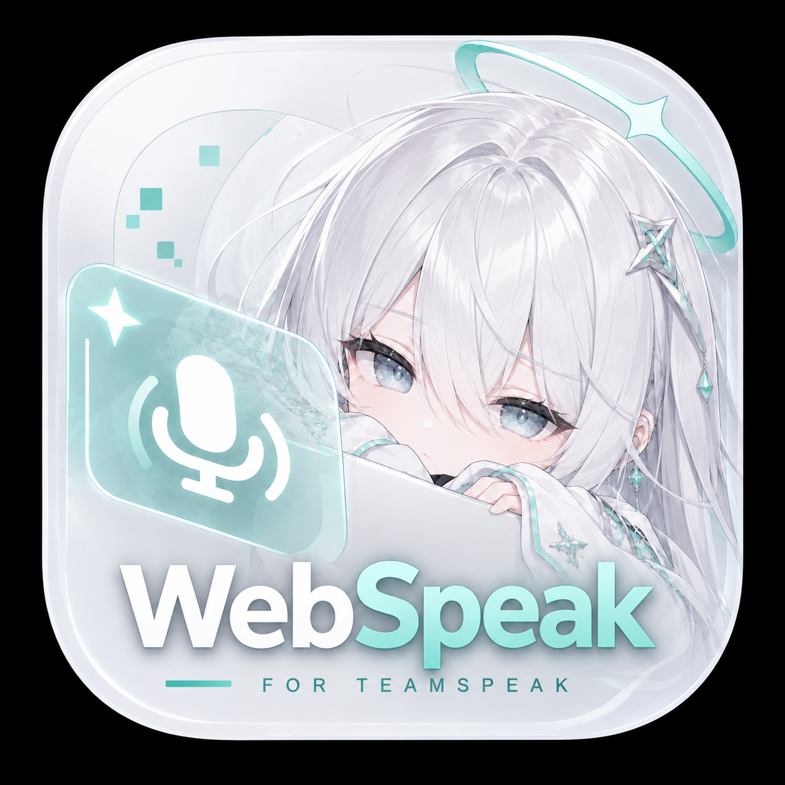

<div align="center">

# WebSpeak

<p>
  
</p>

**让 TeamSpeak 真正进入浏览器。**

自托管的 TeamSpeak 3 / TeamSpeak 6 网页客户端。打开网页即可加入语音、查看频道、发送消息，无需安装桌面客户端。

**在线体验：[webspeak.online](https://webspeak.online)**

[](https://github.com/EchoSixHIYA/WebSpeak-client-for-TeamSpeak)
[](https://github.com/EchoSixHIYA/WebSpeak-client-for-TeamSpeak/releases/tag/v0.1.5)
[](LICENSE)
[](https://www.teamspeak.com/)

[中文](#中文) · [English](#english) · [更新日志](#更新日志--changelog) · [快速开始](#快速开始--quick-start) · [社区](#社区--community)

</div>

## 中文

WebSpeak 是一个面向 TeamSpeak 服务器的浏览器客户端。部署一次，用户通过网页即可加入语音空间，不需要安装 TeamSpeak 桌面客户端。

### 功能

- 支持 TeamSpeak 3 和 TeamSpeak 6，自动识别协议。
- 浏览频道、在线成员和实时成员状态。
- 加入、切换频道，并显示成员所在频道。
- 频道文字聊天、服务器消息、私聊和戳一戳。
- 浏览器麦克风和扬声器选择、音量调节、输入电平和本地麦克风测试。
- 一键闭麦/开麦、VOX 语音激活、发言状态提示。
- 可选 WebRTC 低延迟语音，网络不支持时自动回退。
- 固定服务器、开放服务器和一次性邀请链接三种访问方式。
- 管理控制台：默认目标、邀请链接、在线会话、日志、诊断和数据库备份。
- 中英文界面、主题切换、桌面端和移动端适配。
- 移动端提供成员操作菜单，桌面端支持右键菜单。

### 快速开始 · Quick Start

#### Docker Compose（推荐）

要求：安装 Docker Engine 和 Docker Compose。

```bash
git clone https://github.com/EchoSixHIYA/WebSpeak-client-for-TeamSpeak.git
cd WebSpeak-client-for-TeamSpeak
docker compose pull
docker compose up -d
```

打开 `http://你的服务器地址:3040/`，首次进入管理后台 `/admin` 使用：

```text
账号：admin
密码：admin
```

首次登录必须修改管理员密码。然后在管理控制台的“服务器”页面设置“默认 TeamSpeak 目标”，例如：

```text
106.15.36.235#9987
```

用户欢迎页没有邀请链接参数时，会自动使用管理员设置的默认目标。开放模式下，用户可以自行输入要连接的服务器地址和端口。

数据会保存在 Docker volume `webspeak-data` 中。升级时执行：

```bash
docker compose pull
docker compose up -d
```

不要使用 `docker compose down -v`，否则会删除数据库和管理员配置。

如需更换网页端口：

```bash
WEBSPEAK_PORT=3041 docker compose up -d
```

#### 源码运行

需要 Node.js `22.5.0` 或更高版本，以及 `@discordjs/opus` 所需的本地编译工具。

```bash
npm ci
npm --prefix web ci
npm --prefix web run build
npm run build
node dist/index.js
```

服务默认监听 `3040` 端口。

### WebRTC 低延迟语音

WebRTC 是可选功能，由 WebSpeak 自带，不需要额外部署媒体服务器。

1. 在管理后台打开“WebRTC 语音”。
2. 在部署主机所在云平台安全组或上游防火墙放行入站 UDP `40000–40099`。
3. 重新进入语音空间即可生效。

Docker Compose 已自动发布 `40000–40099/UDP`，但无法替你修改云安全组。Ubuntu 使用 UFW 时可执行：

```bash
sudo ufw allow 40000:40099/udp
```

网页和 WSS 使用 TCP `80/443`。TeamSpeak 的 `9987` 只需要让 WebSpeak 主机能够访问目标 TeamSpeak，不需要在 WebSpeak 主机对公网开放。WebRTC 不支持或端口未放行时，客户端会自动使用兼容模式。

### 管理员设置

管理员可以在控制台中：

- 修改默认 TeamSpeak 目标和服务器密码。
- 选择固定目标或允许用户自定义目标。
- 创建、撤销和设置有效期的邀请链接。
- 查看在线会话、运行日志、诊断信息和审计记录。
- 下载诊断报告和 SQLite 数据库备份。
- 开启或关闭 WebRTC 低延迟语音。

### 浏览器要求

- 使用较新的 Chrome、Edge 或其他支持 WebRTC 的现代浏览器。
- 使用麦克风需要浏览器权限；公网部署建议使用 HTTPS。
- 目标 TeamSpeak 服务器必须能被 WebSpeak 主机访问。

### 更新日志 · Changelog

完整记录见 [`CHANGELOG.md`](CHANGELOG.md)。

#### 2026-09-04 · v0.1.6

- 新增保持身份并发连接提醒。
- 新增桌面端伴奏共享功能。
- 新增网站 favicon，并更新仓库 README 主视觉。

#### 2026-09-04 · v0.1.5

- 修复并优化主题切换按钮，首次点击即可切换，并使用太阳/月亮图标。
- 修复浏览器身份保存与退出后的保持逻辑。

#### 2026-09-03 · v0.1.4

- 修复 WebRTC 语音收发与发言状态同步。
- 修复频道文字消息在 WebSpeak 客户端之间无法互收。
- 优化管理员页面、运行日志换行和移动端顶部布局；新增 Bilibili 入口及登录页返回首页。

#### 2026-09-03 · v0.1.3

- 增加可选 WebRTC 低延迟语音。
- 支持在管理员页面直接启用 WebRTC，无需额外媒体服务器。
- 更新 TeamSpeak 集成，改善频道、成员和实时状态同步。
- 优化语音缓冲和连接回退，减少网络抖动造成的延迟堆积。
- 公网部署放行 UDP `40000–40099` 后，双浏览器语音测试稳定运行，实测间隔峰值约 `27–83ms`。

#### 2026-09-02 · v0.1.2

- 大幅优化移动端界面和成员操作。
- 首页增加 GitHub、当前版本和更新日志入口。
- 修复设置按钮错位，优化窄屏布局和滚动体验。
- 增加 AudioWorklet、设备选择和更稳定的语音缓冲处理。

#### 2026-09-02 · v0.1.1

- 正式提供浏览器客户端、管理控制台、邀请链接和运维功能。
- 修复成员同步、私聊断开和频道显示问题。
- 增加中英文切换、默认目标、首次登录改密和一键闭麦。
- 发布 Windows、Linux 和 Docker 部署方式。

#### 2026-08-31 · v0.1.0

- 首个规范化版本。

### 社区 · Community

QQ群：`869500475`

加入 QQ 群获取使用帮助、版本更新和交流支持：


### 许可证

WebSpeak 使用 [GNU Affero General Public License v3.0](LICENSE) 发布。

## English

WebSpeak is a self-hosted browser client for TeamSpeak 3 and TeamSpeak 6. Deploy it once and let users join voice channels from a browser without installing the desktop TeamSpeak client.

**Live demo: [webspeak.online](https://webspeak.online)**

### Features

- TeamSpeak 3 and TeamSpeak 6 support with automatic protocol detection.
- Live channel tree, online members, member locations, and status updates.
- Channel switching and member presence grouped under the correct channel.
- Channel text chat, server messages, private messages, and poke actions.
- Browser microphone and speaker selection, volume control, input level, and local microphone test.
- One-click microphone mute/unmute, VOX activation, and speaking indicators.
- Optional low-latency WebRTC audio with automatic compatibility fallback.
- Fixed targets, open targets, and expiring one-time invite links.
- Admin console for targets, invites, sessions, logs, diagnostics, and database backups.
- Chinese and English UI, theme switching, and responsive desktop/mobile layouts.
- Mobile member action menus and desktop context menus.

### Quick Start

#### Docker Compose (recommended)

Requirements: Docker Engine and Docker Compose.

```bash
git clone https://github.com/EchoSixHIYA/WebSpeak-client-for-TeamSpeak.git
cd WebSpeak-client-for-TeamSpeak
docker compose pull
docker compose up -d
```

Open `http://your-server:3040/`. On the first admin login at `/admin`, use:

```text
Username: admin
Password: admin
```

You must change the administrator password after the first login. Then configure the **Default TeamSpeak target** in the **Servers** page, for example:

```text
106.15.36.235#9987
```

If a welcome link does not contain an invite target, the default target is pre-filled automatically. In open mode, users may enter their own TeamSpeak address and port.

Data is stored in the `webspeak-data` Docker volume. To upgrade:

```bash
docker compose pull
docker compose up -d
```

Do not run `docker compose down -v`, because it removes the database and administrator settings.

To change the web host port:

```bash
WEBSPEAK_PORT=3041 docker compose up -d
```

#### Run from source

Requires Node.js `22.5.0` or newer and native build tools for `@discordjs/opus`.

```bash
npm ci
npm --prefix web ci
npm --prefix web run build
npm run build
node dist/index.js
```

The service listens on port `3040` by default.

### Low-latency WebRTC audio

WebRTC is optional and bundled with WebSpeak. No separate media server is required.

1. Enable **WebRTC audio** in the admin console.
2. Allow inbound UDP `40000–40099` in the cloud security group or upstream firewall for the WebSpeak host.
3. Re-enter the voice space to apply the setting.

Docker Compose publishes `40000–40099/UDP` automatically, but it cannot change a cloud security group. With Ubuntu UFW:

```bash
sudo ufw allow 40000:40099/udp
```

The web page and WSS signaling use TCP `80/443`. TeamSpeak port `9987` only needs to be reachable from WebSpeak to the target TeamSpeak server; it does not need to be exposed publicly on the WebSpeak host. If WebRTC is unavailable, the client automatically uses the compatibility mode.

### Administrator settings

The admin console can:

- Set the default TeamSpeak target and server password.
- Choose a fixed target or allow users to enter their own target.
- Create, revoke, expire, and limit invite links.
- View online sessions, runtime logs, diagnostics, and audit records.
- Download diagnostic reports and SQLite backups.
- Enable or disable low-latency WebRTC audio.

### Browser requirements

- A recent Chrome, Edge, or another modern browser with WebRTC support.
- Microphone permission is required for voice input; HTTPS is recommended for public deployments.
- The target TeamSpeak server must be reachable from the WebSpeak host.

### Changelog

See [`CHANGELOG.md`](CHANGELOG.md) for the complete release history.

#### 2026-09-04 · v0.1.6

- Added a warning for concurrent remembered-identity connections.
- Added desktop accompaniment sharing.
- Added a site favicon and refreshed the repository README branding.

#### 2026-09-04 · v0.1.5

- Fixed and refined the theme toggle so the first click switches themes, with sun/moon icons.
- Fixed browser identity persistence across exit and return.

#### 2026-09-03 · v0.1.4

- Fixed WebRTC voice transport and speaking-state synchronization.
- Fixed channel text messages between WebSpeak clients.
- Refined admin pages, log wrapping, and narrow-screen header layout; added Bilibili and admin-login home links.

#### 2026-09-03 · v0.1.3

- Added optional low-latency WebRTC audio.
- Added an admin switch for WebRTC without requiring a separate media server.
- Updated TeamSpeak integration for better channel, member, and realtime status synchronization.
- Improved audio buffering and connection fallback to reduce delay growth during network jitter.
- After allowing inbound UDP `40000–40099`, a two-browser voice test ran reliably with observed peak gaps of about `27–83 ms`.

#### 2026-09-02 · v0.1.2

- Major mobile UI and member-action improvements.
- Added GitHub, current-version, and changelog entries to the welcome page.
- Fixed settings-button alignment and improved narrow-screen layout and scrolling.
- Added AudioWorklet, device selection, and more stable voice buffering.

#### 2026-09-02 · v0.1.1

- Official browser client, admin console, invite links, and operations tools.
- Fixed member synchronization, private-message disconnects, and channel display issues.
- Added Chinese/English switching, default targets, first-login password rotation, and one-click mute.
- Added Windows, Linux, and Docker deployment options.

#### 2026-08-31 · v0.1.0

- First normalized release.

### Community

QQ group: `869500475`

Join the group for support, release updates, and discussion:


### License

WebSpeak is released under the [GNU Affero General Public License v3.0](LICENSE).
