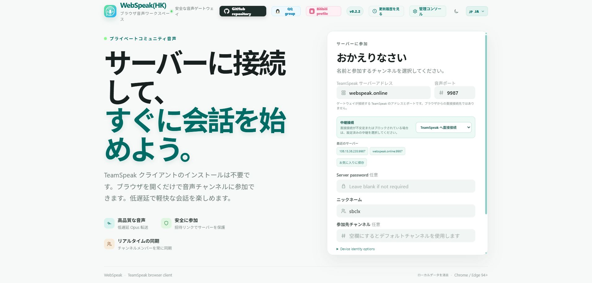
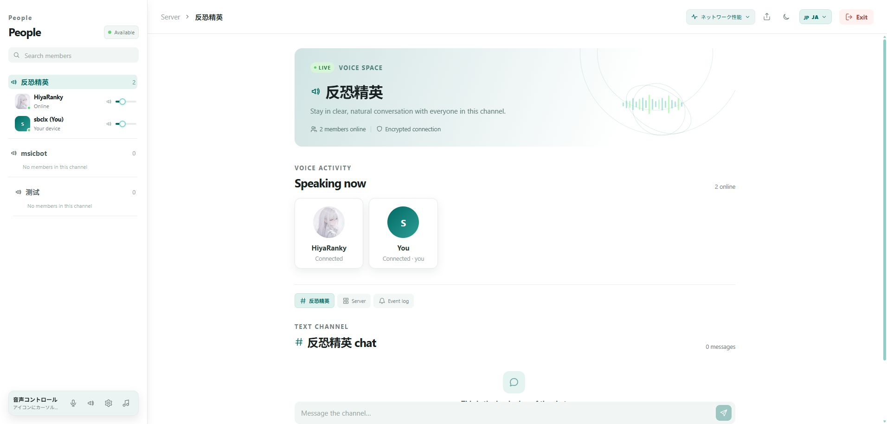
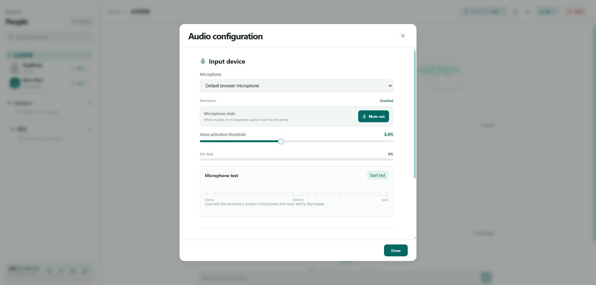
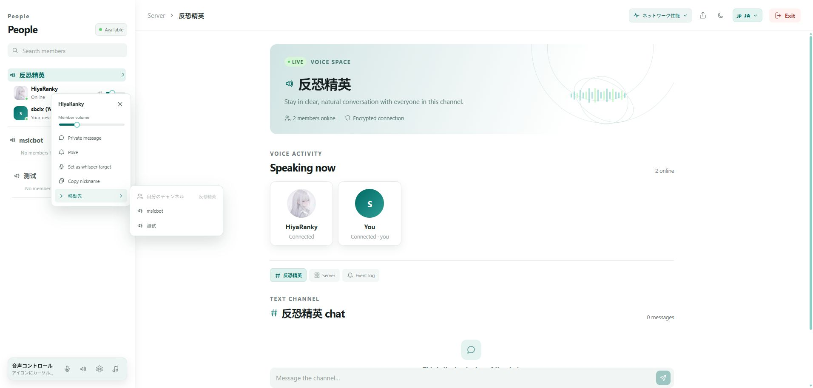

# WebSpeak · 日本語

[プロジェクトトップ](../README.md) · [简体中文](./README.zh-CN.md) · [English](./README.en.md) · [Deutsch](./README.de.md) · [Русский](./README.ru.md)

## プロジェクト概要

| 観点 | 説明 |
| --- | --- |
| **WHAT** | WebSpeak は TeamSpeak 3 / TeamSpeak 6 向けのセルフホスト型ブラウザクライアント兼音声ゲートウェイです。 |
| **WHY** | デスクトップクライアントをインストールせず、ブラウザからチャンネルに参加できます。運用者はサーバーとデータを管理できます。 |
| **HOW** | 起動後、管理コンソールで TeamSpeak の接続先とアクセス方針を設定します。ブラウザが画面と音声を担当し、WebSpeak がゲートウェイとして接続します。 |

## オンラインデモ

アドレス: <https://webspeak.online>

デモは香港にあります。ネットワークと負荷が不安定な場合があるため、遅延、切断、一時的な利用不可は各自の環境での動作を示すものではありません。

## ✨ 機能

| 機能 | 説明 |
| --- | --- |
| TeamSpeak | TeamSpeak 3 / 6 に対応し、対象プロトコルを自動検出します。 |
| クロスプラットフォーム P2P 画面共有 | ブラウザユーザーと TeamSpeak 6 ネイティブクライアントが互いに画面共有を開始・視聴できます。メディアは WebRTC/ICE で直接送信し、WebSpeak はシグナリングだけを中継します。 |
| IPv6 | IPv6 の接続先と DNS から解決された IPv6 アドレスに標準対応します。 |
| チャンネルとメンバー | チャンネルツリー、リアルタイムのメンバー状態、チャンネル移動。 |
| リアルタイム音声 | Opus、互換トランスポート、内蔵 WebRTC による低遅延音声。 |
| 音声操作 | マイク、スピーカー、音量、VOX、ミュート、メンバーごとの音量調整。 |
| ブラウザ側ノイズ抑制 | マイクのノイズ抑制をブラウザの音声取得段階で任意に使用でき、サーバー側の追加処理は不要です。 |
| チャットと操作 | チャンネル/サーバーチャット、個人メッセージ、つつく、ウィスパー対象。 |
| BGM共有 | デスクトップブラウザで音声付きウィンドウやタブの音をチャンネルに共有。 |
| ID とアクセス | ID の保存、接続先の指定、期限・回数付き招待リンク。 |
| 管理コンソール | 接続先、アクセス、WebRTC、中継、招待、セッション、ログ、診断、バックアップ。 |
| スキン | 保護された昼・夜・ILLUSIA スキンに加え、管理者が有効化とデフォルトを管理するインスタンス `.wskin` に対応。 |
| インターフェース | 中文、English、Deutsch、Русский、日本語、レスポンシブ表示。 |

## 🖼️ インターフェースのスクリーンショット

日本語のホーム、音声ワークスペース、オーディオ設定、メンバー操作メニューを掲載しています。

### ホーム

<p align="center"></p>

### 音声ワークスペース

<p align="center"></p>

### オーディオ設定

<p align="center"></p>

### メンバーメニュー

<p align="center"></p>

## 🧩 高度な機能

### WebRTC

**管理コンソール → サーバー → 詳細設定** で有効にします。無効の状態で UDP ポート範囲（初期値 `40000–40099`）を設定し、ファイアウォールで許可して保存してください。有効中は範囲がロックされ、新しい接続で WebRTC を使用します。非対応のブラウザは互換トランスポートに戻ります。公開サイトでは HTTPS が必要です。

### 画面共有の ICE 候補

画面共有のメディアは引き続きブラウザ間の直接接続を優先し、WebSpeak はシグナリングだけを中継します。初期状態では TeamSpeak の公開 STUN サービスで外部候補を検出します。STUN はメディアを運びません。認可済みの外部 TURN を使う場合は、起動前に `WEBSPEAK_SCREEN_SHARE_ICE_SERVERS` を JSON 配列で設定できます。

```json
[{"urls":"stun:turn.teamspeak.com:3478"},{"urls":"turns:turn.example.com:5349","username":"<username>","credential":"<credential>"}]
```

TURN を設定した場合、メディアは外部 TURN サービスを経由することがありますが、WebSpeak ゲートウェイは経由しません。未設定時は直接接続と STUN のみを使用します。

### クロスプラットフォーム P2P 画面共有

ブラウザユーザーと TeamSpeak 6 ネイティブクライアントは、互いの画面共有を検出・開始・視聴できます。ブラウザ間、およびブラウザとネイティブクライアント間の画面メディアは、可能な限り WebRTC/ICE の直接接続で送信されます。WebSpeak はセッション認証、共有状態、SDP/ICE シグナリングを担当しますが、画面メディア自体は転送しません。画面には配信中の状態と視聴者数が表示され、音量、全画面、終了を操作できます。取得設定は最大 1080p / 60 FPS に対応し、WebRTC 統計も確認できます。

### 中継サーバー

中継は現在の WebSpeak セッションの TeamSpeak 通信だけを転送し、VPN ではありません。管理コンソールで複数のノードに名前、アドレス、トークンを設定すると、ユーザーは直接接続または中継を選択できます。中継モードは専用の転送サービスとして動作し、ゲスト画面や管理コンソールを提供しません。

中継サービスは WebSpeak に組み込まれており、Node.js の標準ライブラリを使用します。GOST や sing-box などのプロキシフレームワークは不要です。WebRTC は [werift](https://github.com/shinyoshiaki/werift-webrtc)、TeamSpeak 接続はプロジェクトが保守する [EchoSixHIYA/teamspeak-js](https://github.com/EchoSixHIYA/teamspeak-js) SDK を使用します。

## 🚀 デプロイ

| 方法 | 用途 |
| --- | --- |
| Docker Compose | 常時稼働サーバーと簡単な更新 |
| Release パッケージ | Node.js やビルドツールを使わない起動 |
| ソースから | 開発やカスタマイズ |

### Docker Compose

```bash
git clone --depth 1 https://github.com/EchoSixHIYA/WebSpeak-client-for-TeamSpeak.git
cd WebSpeak-client-for-TeamSpeak
docker compose pull
docker compose up -d
```

起動後に `http://<your-host>:3040/admin` を開き、`admin` / `admin` でログインして直ちにパスワードを変更し、TeamSpeak を設定します。データは `webspeak-data` volume に保存されます。データベースを消さない場合は `docker compose down -v` を実行しないでください。

### Release パッケージ

[Releases](https://github.com/EchoSixHIYA/WebSpeak-client-for-TeamSpeak/releases/latest) から Windows x64 または Linux x64 のパッケージを取得し、専用フォルダーに展開して `start-webspeak.cmd` または `./start-webspeak.sh` を実行します。

### ソースから

```bash
npm ci --ignore-scripts
npm run prepare:sdk
npm rebuild @discordjs/opus --foreground-scripts
npm --prefix web ci
npm --prefix web run build
npm run build
npm start
```

## ⚠️ 要件と注意

- ソースからのビルドには Node.js `>=22.5` が必要です。Docker と Release には必要な実行環境が含まれます。
- WebRTC に対応した最新の Chrome、Edge などを使用してください。マイクとウィンドウ音声には通常 HTTPS が必要です。
- WebSpeak のホストから TeamSpeak に到達できる必要があります。標準音声ポートは `9987` です。
- Web サービスは `3040/TCP` を使用します。公開時は HTTPS と WebSocket をリバースプロキシ経由で公開してください。
- IPv6 にはルーティング可能な IPv6、OS/コンテナで有効な IPv6、適切なファイアウォール設定が必要です。リテラルは `[2001:db8::1]#9987` の形式です。
- 保存したブラウザ ID は同じブラウザで同時に1接続だけ使用できます。
- BGM共有はデスクトップのみで、WebRTC が必要です。

## コミュニティと関連プロジェクト

- [QQ グループ](http://qm.qq.com/cgi-bin/qm/qr?_wv=1027&k=yhumUMDD9PmyYFWdXWUb_x7hM5trFQY8&authKey=Pw3HBGT7GwMinTQnuFGfnpf0aRSzXOJKcAiujVP1%2BXMpjheAKrncTRivicBJxpjV&noverify=0&group_code=869500475)
- [Telegram グループ](https://t.me/+8qShpTcuN9A3MWY9)
- [NeteaseTSBot](https://github.com/yichen11818/NeteaseTSBot) — Web コンソール付き TeamSpeak 音楽ボット。

## 🧾 更新履歴

| バージョン | 内容 |
| --- | --- |
| 0.2.5-preview | 2026-09-27 | `.wskin` スキン、管理者向けの有効化/デフォルト設定、保護された昼・夜・ILLUSIA 内蔵スキンを追加。未完成の Aurora Voice サンプルを削除し、読み込み時のちらつき、ダークモードの視認性、音声画面のアートレイヤーを修正。公式スキン開発 Agent Skill も追加しました。 |
| [v0.2.4](https://github.com/EchoSixHIYA/WebSpeak-client-for-TeamSpeak/releases/tag/v0.2.4) | ブラウザと TeamSpeak 6 ネイティブクライアント間のクロスプラットフォーム P2P 画面共有を追加しました。STUN/外部 TURN 設定、プレーヤーと視聴者状態、1080p/60 FPS 取得設定、WebRTC 統計に対応し、共有操作と訪問者番号も改善しました。 |
| [v0.2.3](https://github.com/EchoSixHIYA/WebSpeak-client-for-TeamSpeak/releases/tag/v0.2.3) | チャンネルメンバーの移動操作と権限に応じた直接移動を追加し、アバター表示、ミュート状態の同期、保存 ID の復元に対応しました。5 言語のスクリーンショットとドキュメントも更新しました。 |
| [v0.2.2](https://github.com/EchoSixHIYA/WebSpeak-client-for-TeamSpeak/releases/tag/v0.2.2) | ブラウザ側マイクノイズ抑制、ロシア語・日本語 UI、言語別ウェルカム文を追加。音量操作と PR #2 を基にしたエラー表示・エラーコードを改善しました。 |
| [v0.2.1](https://github.com/EchoSixHIYA/WebSpeak-client-for-TeamSpeak/releases/tag/v0.2.1) | 接続エラー表示を改善し、IPv6 接続先を標準対応しました。 |
| [v0.2.0](https://github.com/EchoSixHIYA/WebSpeak-client-for-TeamSpeak/releases/tag/v0.2.0) | パスワード案内、正式な中継モード、複数中継選択、接続診断を追加しました。 |
| [v0.1.8](https://github.com/EchoSixHIYA/WebSpeak-client-for-TeamSpeak/releases/tag/v0.1.8) | Docker 起動を簡略化し、15秒の接続タイムアウトと継続的なネットワーク監視を追加しました。 |

完全な履歴は [CHANGELOG.md](../CHANGELOG.md) を参照してください。

## ライセンス

WebSpeak は [GNU Affero General Public License v3.0 only](../LICENSE) の下で公開されています。
