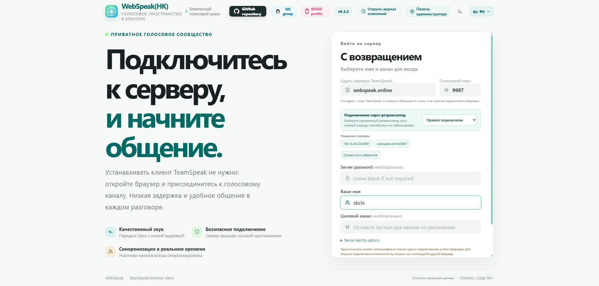
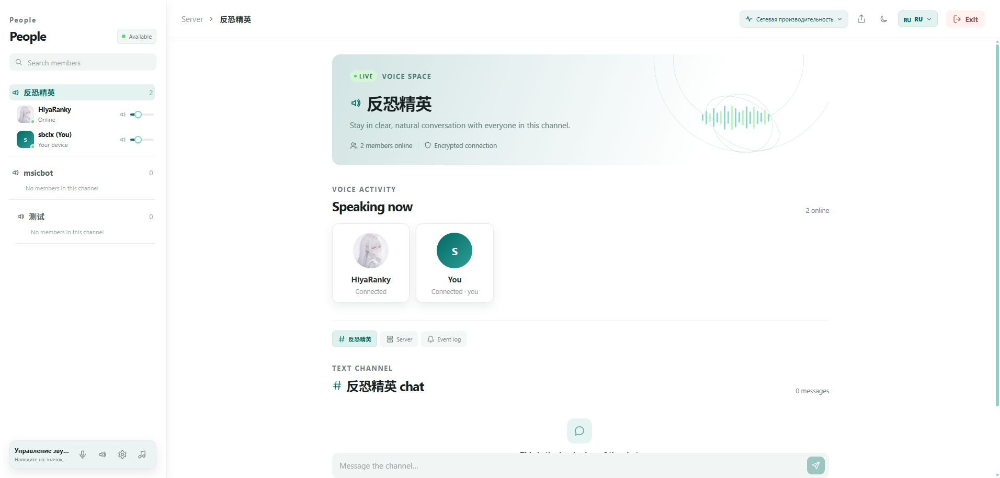
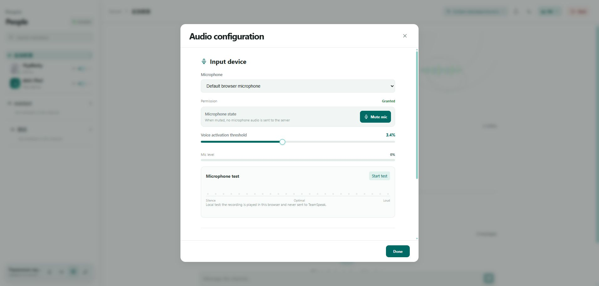
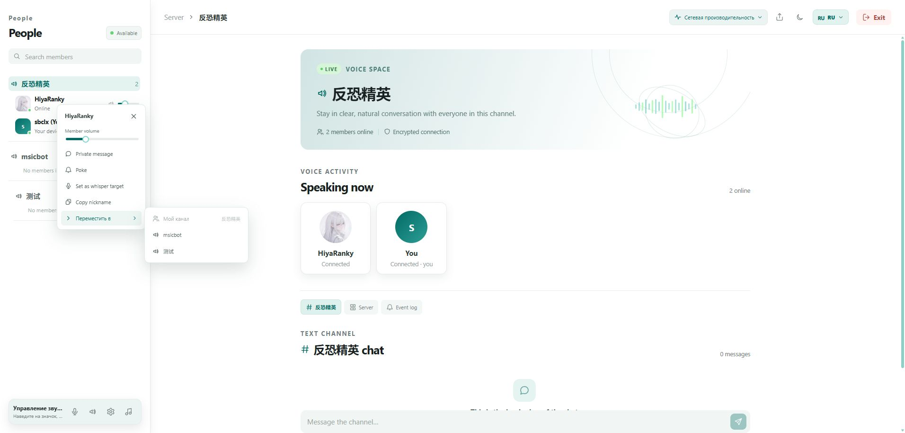

# WebSpeak · Русский

[Главная проекта](../README.md) · [简体中文](./README.zh-CN.md) · [English](./README.en.md) · [Deutsch](./README.de.md) · [日本語](./README.ja.md)

## О проекте

| Логика | Описание |
| --- | --- |
| **WHAT** | WebSpeak — самостоятельно размещаемый веб-клиент и голосовой шлюз для TeamSpeak 3 и TeamSpeak 6. |
| **WHY** | Пользователям не нужно устанавливать настольный клиент: достаточно открыть браузер, а оператор сохраняет контроль над сервером и данными. |
| **HOW** | После запуска настройте цель TeamSpeak и политику доступа в панели администратора. Браузер отвечает за интерфейс и аудио, WebSpeak — за шлюз. |

## Онлайн-демо

Адрес: <https://webspeak.online>

Демо-сервер находится в Гонконге; сеть и нагрузка могут быть нестабильными. Задержки, разрывы или временная недоступность демо не характеризуют самостоятельное развертывание.

## ✨ Возможности

| Возможность | Описание |
| --- | --- |
| TeamSpeak | Поддержка TeamSpeak 3 и TeamSpeak 6 с автоматическим определением протокола. |
| Кроссплатформенная P2P-трансляция экрана | Пользователи браузера и нативные клиенты TeamSpeak 6 могут запускать и смотреть трансляции друг друга; медиаданные идут напрямую по WebRTC/ICE, а WebSpeak передаёт только сигнальные сообщения. |
| IPv6 | IPv6-цели и IPv6-адреса, полученные через DNS, поддерживаются по умолчанию. |
| Каналы и участники | Дерево каналов, состояние участников в реальном времени и переход между каналами. |
| Голос в реальном времени | Opus, совместимый транспорт и встроенный WebRTC с низкой задержкой. |
| Управление аудио | Микрофон, динамики, громкость, VOX, отключение микрофона и отдельная громкость участников. |
| Шумоподавление в браузере | Опциональное шумоподавление микрофона на этапе захвата в браузере без дополнительной обработки звука на сервере. |
| Чат и действия | Чат канала и сервера, личные сообщения, толчки и цели шёпота. |
| Фоновая музыка | На компьютере можно поделиться звуком окна или вкладки с текущим каналом. |
| Идентичность и доступ | Сохранение идентичности, собственные цели и приглашения с ограничением срока и числа использований. |
| Панель администратора | Цели, доступ, WebRTC, ретрансляторы, приглашения, сессии, логи, диагностика и резервные копии. |
| Интерфейс | 中文, English, Deutsch, Русский и 日本語, светлая/тёмная тема и адаптивная верстка. |

## 🖼️ Скриншоты интерфейса

Скриншоты показывают русскую главную страницу, голосовое пространство, настройки аудио и меню участника.

### Главная страница

<p align="center"></p>

### Голосовое пространство

<p align="center"></p>

### Настройки аудио

<p align="center"></p>

### Меню участника

<p align="center"></p>

## 🧩 Расширенные функции

### WebRTC

Включается в **Панель администратора → Сервер → Расширенные настройки**. До включения задайте диапазон UDP-портов (по умолчанию `40000–40099`), откройте его в firewall и сохраните. При включённом WebRTC диапазон заблокирован; новые подключения используют WebRTC, а неподдерживаемые браузеры переходят на совместимый транспорт. Для публичного доступа нужен HTTPS.

### ICE для демонстрации экрана

Медиа демонстрации экрана по-прежнему предпочитает прямое соединение между браузерами; WebSpeak только передаёт сигнальные сообщения. По умолчанию используются публичные STUN-серверы TeamSpeak для поиска внешних кандидатов, STUN не передаёт медиаданные. Авторизованный внешний TURN можно задать через `WEBSPEAK_SCREEN_SHARE_ICE_SERVERS` в виде JSON-массива, например:

```json
[{"urls":"stun:turn.teamspeak.com:3478"},{"urls":"turns:turn.example.com:5349","username":"<username>","credential":"<credential>"}]
```

При настроенном TURN медиа может идти через этот внешний сервис, но не через шлюз WebSpeak. Без TURN используются только прямые ICE-пути и STUN.

### Кроссплатформенная P2P-трансляция экрана

Пользователи браузера и нативные клиенты TeamSpeak 6 могут обнаруживать, запускать и смотреть трансляции друг друга. Между браузерами, а также между браузером и нативным клиентом, экран передаётся по прямому соединению WebRTC/ICE, когда это возможно; WebSpeak отвечает за авторизацию сессии, состояние трансляции и передачу SDP/ICE-сигналов, но не переносит медиаданные экрана. Интерфейс показывает статус трансляции и число зрителей и предоставляет регулировку громкости, полноэкранный режим и выход. Для захвата доступны настройки до 1080p и 60 FPS, а также статистика WebRTC.

### Ретрансляторы

Ретранслятор передаёт только TeamSpeak-трафик текущей сессии и не является VPN. В панели администратора добавьте один или несколько узлов, задайте имя, адрес и токен. Пользователь сможет выбрать прямое подключение или настроенный ретранслятор. Режим ретранслятора запускается отдельно и не предоставляет страницу посетителя или панель администратора.

Сервис ретрансляции встроен в WebSpeak и использует стандартные библиотеки Node.js; GOST, sing-box и другие прокси-фреймворки не требуются. WebRTC использует [werift](https://github.com/shinyoshiaki/werift-webrtc), а TeamSpeak — поддерживаемый проектом [SDK EchoSixHIYA/teamspeak-js](https://github.com/EchoSixHIYA/teamspeak-js).

## 🚀 Развертывание

| Способ | Подходит для |
| --- | --- |
| Docker Compose | Постоянного сервера и простых обновлений |
| Пакет Release | Запуска без Node.js и инструментов сборки |
| Из исходников | Разработки и настройки проекта |

### Docker Compose

```bash
git clone --depth 1 https://github.com/EchoSixHIYA/WebSpeak-client-for-TeamSpeak.git
cd WebSpeak-client-for-TeamSpeak
docker compose pull
docker compose up -d
```

После запуска откройте `http://<ваш-хост>:3040/admin`, войдите с `admin` / `admin`, сразу смените пароль и настройте TeamSpeak. Данные хранятся в volume `webspeak-data`. Не используйте `docker compose down -v`, если не хотите удалить базу и настройки.

### Пакет Release

Скачайте подходящий пакет Windows x64 или Linux x64 из [Releases](https://github.com/EchoSixHIYA/WebSpeak-client-for-TeamSpeak/releases/latest), распакуйте в отдельную папку и запустите `start-webspeak.cmd` или `./start-webspeak.sh`.

### Из исходников

```bash
npm ci --ignore-scripts
npm run prepare:sdk
npm rebuild @discordjs/opus --foreground-scripts
npm --prefix web ci
npm --prefix web run build
npm run build
npm start
```

## ⚠️ Требования и замечания

- Node.js `>=22.5` нужен для сборки из исходников; Docker и Release уже содержат необходимые компоненты.
- Нужен современный Chrome, Edge или другой браузер с WebRTC. Микрофон и звук окна обычно требуют HTTPS.
- WebSpeak должен иметь доступ к TeamSpeak; стандартный голосовой порт — `9987`.
- Веб-сервис использует `3040/TCP`; для публичного сайта направьте HTTPS и WebSocket через обратный прокси.
- Для IPv6 нужен маршрутизируемый IPv6, включённый IPv6 в ОС/контейнере и правила firewall. Литерал задаётся как `[2001:db8::1]#9987`.
- Одна сохранённая браузерная идентичность может использоваться только одним активным подключением.
- Фоновая музыка доступна только на компьютере и требует WebRTC.

## Сообщество и проекты

- [QQ-группа](http://qm.qq.com/cgi-bin/qm/qr?_wv=1027&k=yhumUMDD9PmyYFWdXWUb_x7hM5trFQY8&authKey=Pw3HBGT7GwMinTQnuFGfnpf0aRSzXOJKcAiujVP1%2BXMpjheAKrncTRivicBJxpjV&noverify=0&group_code=869500475)
- [Telegram-группа](https://t.me/+8qShpTcuN9A3MWY9)
- [NeteaseTSBot](https://github.com/yichen11818/NeteaseTSBot) — музыкальный бот для TeamSpeak с веб-консолью.

## 🧾 История изменений

| Версия | Изменения |
| --- | --- |
| [v0.2.4](https://github.com/EchoSixHIYA/WebSpeak-client-for-TeamSpeak/releases/tag/v0.2.4) | Добавлена кроссплатформенная P2P-трансляция экрана между браузерами и нативными клиентами TeamSpeak 6; добавлены настройка STUN/внешнего TURN, проигрыватель и состояние зрителей, захват до 1080p/60 FPS и статистика WebRTC; улучшено управление трансляцией и добавлен номер посетителя. |
| [v0.2.3](https://github.com/EchoSixHIYA/WebSpeak-client-for-TeamSpeak/releases/tag/v0.2.3) | Добавлены управление перемещением участников и прямое перемещение с учётом прав; поддержаны аватары, синхронизация микрофона и восстановление идентичности; обновлены скриншоты и документация для пяти языков. |
| [v0.2.2](https://github.com/EchoSixHIYA/WebSpeak-client-for-TeamSpeak/releases/tag/v0.2.2) | Добавлены браузерное шумоподавление микрофона, русский и японский интерфейсы и отдельные тексты приветствия; улучшены управление громкостью и сообщения/коды ошибок на основе PR #2. |
| [v0.2.1](https://github.com/EchoSixHIYA/WebSpeak-client-for-TeamSpeak/releases/tag/v0.2.1) | Улучшены ошибки на странице входа и добавлена поддержка IPv6-целей по умолчанию. |
| [v0.2.0](https://github.com/EchoSixHIYA/WebSpeak-client-for-TeamSpeak/releases/tag/v0.2.0) | Добавлены подсказки пароля, режим ретранслятора, выбор нескольких узлов и диагностика подключений. |
| [v0.1.8](https://github.com/EchoSixHIYA/WebSpeak-client-for-TeamSpeak/releases/tag/v0.1.8) | Упрощён Docker-запуск, добавлен тайм-аут подключения 15 секунд и непрерывный сетевой мониторинг. |

Полная история находится в [CHANGELOG.md](../CHANGELOG.md).

## Лицензия

WebSpeak распространяется по [GNU Affero General Public License v3.0 only](../LICENSE).
